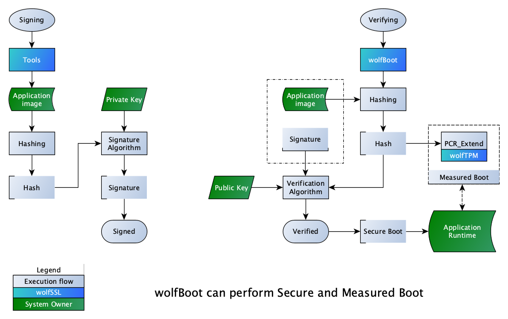

# STM32F4-Discovery-Measured-Boot

Measured Boot example running on STM32F407-Discovery board.

This project is meant to demonstrate Measured Boot using the [wolfBoot secure bootloader](https://github.com/wolfssl/wolfBoot), powered by wolfSSL.

The bootloader expects a Trusted Platform Module(TPM) to be available in hardware.

## Components
  - Bootloader: [wolfBoot](https://github.com/wolfssl/wolfBoot) by wolfSSL
  - Application: Test app printing the extended PCR value that wolfBoot created
  - TPM2.0 stack: [wolfTPM](https://github.com/wolfssl/wolfTPM) by wolfSSL

## Motivation

Measured Boot provides the application with a trace of the boot process. This trace(log) is resistant to spoofing and tampering.

This is achieved by using a TPM which has unique Platform Configuration Registers(PCR) to store hash measurements.

The application(runtime) then can use this tamper-proof log to determine whether the system is in a good known state (trustworthy) or if the system is infected with malware.

After a measurement is stored into one of the TPM's PCRs, the user could perform local attestation using a TPM2.0 Quote and report the log to a remote sever for evaluation:
   - The remote server can compare the log to golden value(s) and alert system owners in case of mismatch.
   - The remote server can directly take action with the device.

The following diagram is a big picture overview of the different guarantee Secure and Measured Boot provide:

## Details

Secure Boot is a way for the system owner to guarantee that the device started with a geniune software. However, this information is not available to the system later on. Therefore, the application runtime must assume any and all software that was run before it is geniune. Measured Boot eliminates the guessing element and provides a way for the application to know the state of the system before it took control.

Measured Boot could evaluate a single component like firmware or application image, or can evaluate multiple components like system settings and user configuration. Additionally, the golden value could be stored within the system for the application to self-evaluate its state without the need of a remote server.

This example performs measured boot, stores the measurement of the firmware image into PCR16 and then boots into a test application. The test application prints the result of the measured boot(the value of the PCR).

This example could be extended to support multiple measurements.

## Prerequisites

- `STM32F4-Discovery` board (STM32F407)
with
- `LetsTrust TPM2.0` module or `Infineon SLB9670` module

Hardware connections must be made between the TPM2.0 module and the STM32F4 board. Here is a wiring table for the Infineon module:

| STM32F4  | Pin function  | TPM2.0 module |
|----------|:-------------:|--------------:|
| PE0      | SPI CS        | Pin 26        |
| PB3      | SPI CLK       | Pin 23        |
| PB4      | SPI MISO      | Pin 21        |
| PB5      | SPI MOSI      | Pin 19        |
| 3V       | +3V           | Pin 1         |
| GND      | Ground        | Pin 6         |

UART1 on the STM32F4 is used. The UART Pinout can be found below:

| STM32F4  | Pin function |
|----------|:------------:|
| PB6      | UART TX      |
| PB7      | UART RX      |
| GND      | Ground       |

Make sure the Ground connection between your USB-UART converter is connected to the STM32F4 board, otherwise UART levels will float and communication will be corrupted.

## Compiling

Before compiling make sure the git submodules are initialized and updated correctly. Use the following commands to make sure:

`wolfboot-examples/$ git submodule --init --update`

`wolfboot-examples/$ cd wolfBoot`

`wolfboot-examples/wolfBoot$ git submodule --init --update`

Enter the project folder for this example:

`wolfboot-examples/wolfBoot$ cd ../test-app-STM32F4-measured-boot`

Makefile in the project folder takes care of compiling wolfBoot, compiling the test application and signing the firmware:

`wolfboot-examples/wolfBoot$ make`

After a successful operation the following files will be available in the project folder:

- factory.bin - Test-app and wolfboot combined, ready for flashing
- image.bin - Test-app without signature
- image_v1_signed.bin - Test-app with signature
- image.map - Listing of the Test-app

## Copyright notice
This example is Copyright (c) 2020 wolfSSL Inc., and distributed under the term of GNU GPL2.

Some STM/STMicroelectronics specific drivers used in this example are Copyright of ST Microelectronics. Distributed freely as specified by BSD-3-Clause License.

wolfBoot, wolfSSL (formerly known as CyaSSL) and wolfCrypt are Copyright (c) 2006-2018 wolfSSL Inc., and licensed for use under GPLv2.

wolfTPM, is Copyright (c) 2018-2020 wolfSSL Inc., and licensed for use under GPLv2.

See the documentation within each component subdirectory for more information about using and distributing this software.

